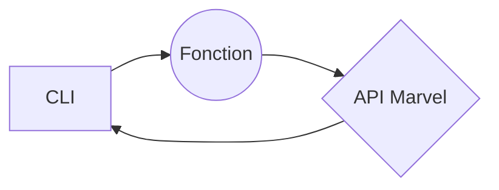

# API_MARVEL

# Summary : 

Ce CLI permet d'interargir avec l'API Marvel afin d'obtenir des informations concernant l'univers de ce dernier. 

# Fonctions : 

- -p : 
- -c : 

## SmartyPants

SmartyPants converts ASCII punctuation characters into "smart" typographic punctuation HTML entities. For example:

|                |ASCII                          |HTML                         |
|----------------|-------------------------------|-----------------------------|
|Single backticks|`'Isn't this fun?'`            |'Isn't this fun?'            |
|Quotes          |`"Isn't this fun?"`            |"Isn't this fun?"            |
|Dashes          |`-- is en-dash, --- is em-dash`|-- is en-dash, --- is em-dash|

## Comment fonctionne la commande :

A partir de mon CLI, j'appelle ma fonction qui va ensuite chercher les informations dans l'API qui ...

vel
